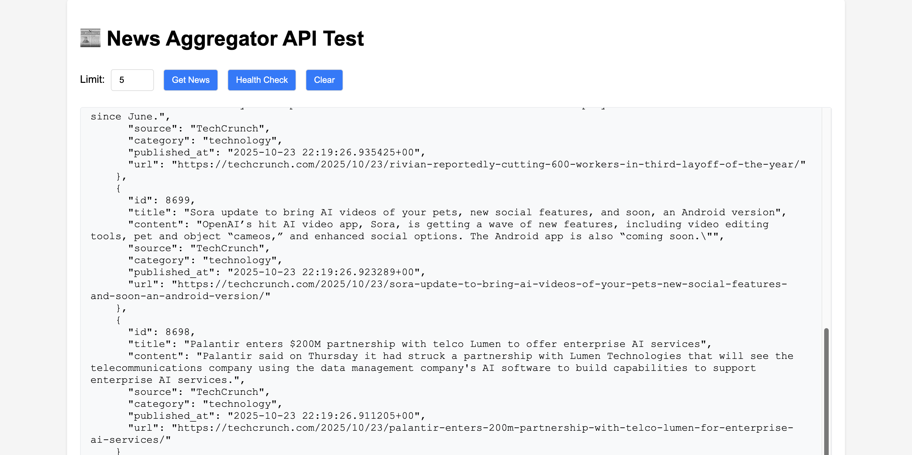

# News Aggregator

A microservice-based news aggregation system built with the [userver](https://github.com/userver-framework/userver) framework, featuring PostgreSQL storage and Redis caching.

## Features

- Automated news collection from RSS feeds
- PostgreSQL database for news storage
- Redis caching for high performance
- REST API for news retrieval
- Microservice architecture

## Architecture

- **CollectorService** (port 8081) - Collects RSS feeds every 30 seconds
- **StorageService** (port 8080) - Stores news in PostgreSQL database  
- **API Gateway** (port 8083) - Main API with Redis caching

## Project Structure

```
newsAggregator/
├── build/                    # Build directory
├── configs/                  # Configuration files
├── scripts/                  # Automation scripts
├── sql/                      # Database scripts
├── src/                      # Source code
│   ├── collector/           # CollectorService
│   ├── gateway/             # API Gateway
│   ├── handlers/            # HTTP handlers
│   └── storage/             # StorageService
├── docker-compose.yml        # Docker services
├── Makefile                  # Build automation
└── README.md                 # This file
```

## Quick Start

### One-Command Setup
```bash
./scripts/quick-start.sh
# or
make quick-start
```

### Manual Setup
```bash
# Build
make build

# Start services
make start

# Check status
make status

# Stop services
make stop
```

## Testing the API

Test all endpoints with formatted JSON output:

```bash
./scripts/test-api.sh
```

Or test individual endpoints:

```bash
# Python script (recommended)
python3 test_api.py --limit 5

# Bash script
./scripts/format-json.sh news 5

# Direct curl
curl -s "http://localhost:8083/news?limit=5" | python3 -m json.tool
```

## API Usage

### Get news
```bash
curl http://localhost:8083/news
```

**Example Response:**
```json
{
  "cache_status": "HIT",
  "count": 5,
  "gateway_info": "API Gateway successfully integrated with StorageService",
  "limit": 5,
  "message": "Latest news from StorageService",
  "news": [
    {
      "category": "technology",
      "content": "The biggest change to the service is the addition of GameNight...",
      "id": 510,
      "published_at": "2025-10-23 14:18:47",
      "source": "TechCrunch",
      "title": "Amazon launches revamped Luna game streaming service",
      "url": "https://techcrunch.com/2025/10/23/amazon-launches-revamped-luna-game-streaming-service/"
    }
  ],
  "status": "success",
  "timestamp": 1761249475601
}
```

### Health checks
```bash
curl http://localhost:8083/health
curl http://localhost:8080/ping
curl http://localhost:8081/status
```

## Scripts

- `quick-start.sh` - Build and start everything
- `build.sh` - Build the project
- `start-dev.sh` - Start all services
- `stop-dev.sh` - Stop all services
- `status.sh` - Check service status

## Make Commands

- `make help` - Show all commands
- `make quick-start` - Build and start everything
- `make build` - Build the project
- `make start` - Start all services
- `make stop` - Stop all services
- `make status` - Check service status
- `make logs` - View all logs
- `make test` - Test API endpoints
- `make clean` - Clean build files

## Requirements

- C++17 or higher
- CMake 3.21 or higher
- PostgreSQL 11 or higher
- Redis 6.0 or higher
- libcurl, ICU libraries

## Development

### Adding RSS sources
Edit `configs/collector_config.yaml` and add sources to the `news_sources` section.

### Adding API endpoints
1. Create handler in `src/handlers/`
2. Register in appropriate `main.cpp`
3. Update service configuration

## Monitoring

All services support structured logging (TSKV format), request tracing, and built-in performance metrics.

Logs are stored in the `logs/` directory:
- `storage.log` - StorageService logs
- `collector.log` - CollectorService logs  
- `gateway.log` - API Gateway logs

## Screenshots
### HTML Client
